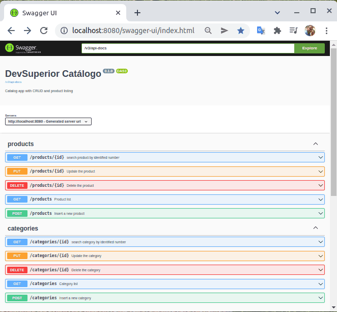

<div align="center" id="top"> 
  

&#xa0;

  <!-- <a href="https://dscatalog.netlify.app">Demo</a> -->
</div>

<h1 align="center">Dscatalog</h1>

<p align="center">
  

  

  

  

  <!--  -->

  <!--  -->

  <!--  -->
</p>

<!-- Status -->

<h4 align="center">
	🚧  Dscatalog 🚀 Under construction...  🚧
</h4>

<hr>

<p align="center">
  <a href="#dart-about">About</a> &#xa0; | &#xa0; 
  <a href="#sparkles-features">Features</a> &#xa0; | &#xa0;
  <a href="#rocket-technologies">Technologies</a> &#xa0; | &#xa0;
  <a href="#white_check_mark-requirements">Requirements</a> &#xa0; | &#xa0;
  <a href="#checkered_flag-starting">Starting</a> &#xa0; | &#xa0;
  <a href="#memo-license">License</a> &#xa0; | &#xa0;
  <a href="#rocket-references">References</a> &#xa0; | &#xa0;
  <a href="https://github.com/jocile" target="_blank">Author</a>
</p>

<br>

## :dart: About

Catalog application development with H2 in-memory database and studying in Bootcamp Spring React of [DevSuperior](https://devsuperior.com.br/) course


## Developed activities:

- Create Spring Boot project
- Create Git monorepo
- Organize the project in layers
  - REST controller
  - Service
  - Data access (Repository)
- Create entities
- Configure project test profile
- Database seeding
- Create REST web services
  - @PathVariable route parameters
  - Request parameters @RequestParam
  - Request body @RequestBody
  - Response from ResponseEntity<T> request
- DTO Standard
- full CRUD
- Exception handling
- Swagger UI (Open API3 collections, environments)
- Audit data
- Data pagination
- Associations between entities (N-N)

## :sparkles: Features

:heavy_check_mark: Product listing;\
:heavy_check_mark: Product search by id;\
:heavy_check_mark: Password recovery;\
:heavy_check_mark: Administrative area with CRUD;\
:heavy_check_mark: Resource page search;\
:heavy_check_mark: Resource search by id;\
:heavy_check_mark: Insert new resource;\
:heavy_check_mark: Update feature;\
:heavy_check_mark: Delete resource;\

## :rocket: Technologies

The following tools were used in this project:

- [Java 11](https://docs.oracle.com/en/java/javase/11/)
- [Spring Boot](https://glysns.gitbook.io/springframework/)
- [Spring Data JPA](https://docs.spring.io/spring-boot/docs/2.5.6/reference/htmlsingle/#boot-features-jpa-and-spring-data)
- [Swagger implementing springdoc-openapi](https://springdoc.org/)
- [React](https://pt-br.reactjs.org/) (to implement)
- [React Native](https://reactnative.dev/) (to implement)
- [TypeScript](https://www.typescriptlang.org/) (to implement)

## :white_check_mark: Requirements

Before starting :checkered_flag:, you need to have [Java JDK11](https://www.oracle.com/java/technologies/downloads/#java11), [Git](https://git-scm.com) and [Maven](https://maven.apache.org/download.cgi) installed.

## :checkered_flag: Starting

```bash
# Clone this project
$ git clone https://github.com/jocile/dscatalog

# Access
$ cd dscatalog

# The server will initialize in the
<http://localhost:8080/swagger-ui/index.html>
```

<!--
# Install dependencies
$ yarn

# Run the project
$ yarn start
-->

## :memo: License

This project is under license from MIT. For more details, see the [LICENSE](LICENSE.md) file.

Made with :heart: by <a href="https://github.com/jocile" target="_blank">Jocile</a>

## :rocket: References

:heavy_check_mark: [DSCatalog Github](https://github.com/devsuperior/dscatalog-resources);\
:heavy_check_mark: [DSCatalog Figma](https://www.figma.com/file/1n0aifcfatWv9ozp16XCrq/DSCatalog-Bootcamp);\
:heavy_check_mark: [Official Apache Maven documentation](https://maven.apache.org/guides/index.html);\
:heavy_check_mark: [Spring Boot Maven Plugin Reference Guide](https://docs.spring.io/spring-boot/docs/2.4.12/maven-plugin/reference/html/);\
:heavy_check_mark: [Create an OCI image](https://docs.spring.io/spring-boot/docs/2.4.12/maven-plugin/reference/html/#build-image);\
:heavy_check_mark: [Spring Web](https://docs.spring.io/spring-boot/docs/2.5.6/reference/htmlsingle/#boot-features-developing-web-applications);\
:heavy_check_mark: [Spring Data JPA](https://docs.spring.io/spring-boot/docs/2.5.6/reference/htmlsingle/#boot-features-jpa-and-spring-data);\
:heavy_check_mark: [Building a RESTful Web Service](https://spring.io/guides/gs/rest-service/);\
:heavy_check_mark: [Serving Web Content with Spring MVC](https://spring.io/guides/gs/serving-web-content/);\
:heavy_check_mark: [Building REST services with Spring](https://spring.io/guides/tutorials/bookmarks/);\
:heavy_check_mark: [Accessing Data with JPA](https://spring.io/guides/gs/accessing-data-jpa/);

- <a href="http://www.youtube.com/watch?feature=player_embedded&v=b8uLFfzcVQ8
  " target="_blank"></a>
- <a href="http://www.youtube.com/watch?feature=player_embedded&v=CAP1IPgeJkw" target="_blank"></a>
- <a href="http://www.youtube.com/watch?feature=player_embedded&v=PfYifUFmXk8" target="_blank"></a>

&#xa0;

<a href="#top">Back to top</a>
